

# PCL 启动器主题解锁教程

本文章影响因子可以突破 1 吗？敬请期待

> [!TIP]
> 阅读这篇文章时，请善用位于右侧的目录功能。*……如果有的话*

## 导言

你是否觉得蓝色的 PCL 启动器过于单调了？想给它一点颜色看看？那么不妨给 PCL 换个主题吧。

## 更换主题

打开你的 PCL 启动器，转到 `设置` → `个性化` → `基础`。如果你看到了以下内容：

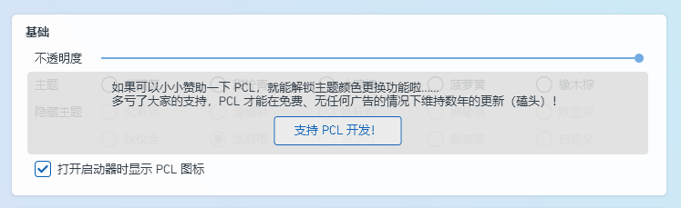

说明你的 PCL 启动器是正式版，无法更换主题。

点击 [<kbd>支持开发！</kbd>](https://ifdian.net/a/LTCat)，前往爱发电并给龙腾猫跃打赏至少 CNY￥6.66 后，私信龙腾猫跃获取快照版 PCL 下载链接。

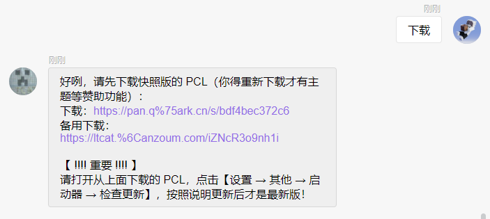

现在，打开快照版 PCL，转到 `设置` → `个性化` → `基础`，应当能看到以下内容：

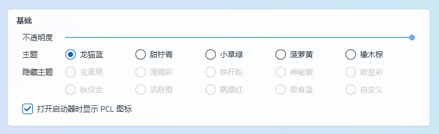

恭喜！你解锁了 PCL 启动器的基础主题。但如你所见，下方还有 10 个未解锁的隐藏主题。接下来，笔者将详细描述解锁各个隐藏主题的方法。

## 隐藏主题的解锁

※ 每种主题在介绍时都会附上一张使用当前主题的图片，以供参考。

※ 以下所有主题均截自 PCL 快照版 2.12.8.0 版本。主题 *可能* 会在后续版本出现轻微的修改。

<h3 style="color: #2B2E34;">玄素黑</h3>

> 灰色是个谎言！

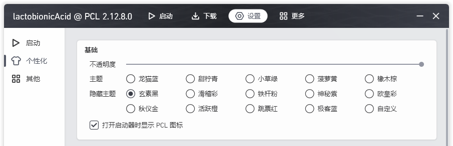

即隐藏主题第 1 行第 1 个主题。这是所有隐藏主题中最容易解锁的主题，只需要用鼠标狂点这个选项即可。

<h3>
滑稽彩
</h3>

> 滑稽树上滑稽果，滑稽树下你和我，滑稽之日搞事情，欢乐多又多

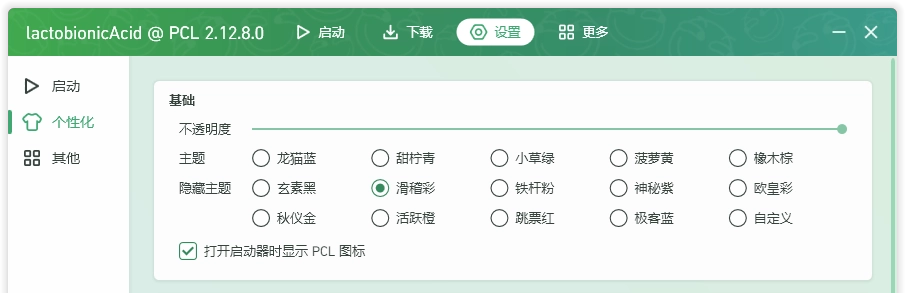

即隐藏主题第 1 行第 2 个主题。将电脑日期调到 4 月 1 日，然后打开 PCL，你会发现“启动游戏”的按钮在尝试远离你的鼠标指针，同时右下角冒出一个小白旗。你需要做的，则是拼手速点击“启动游戏”的按钮，并且**不要按小白旗**。如果你成功了，这个隐藏主题便会解锁。

这个主题的特别之处在于，<spam class="rainbow">其颜色会缓慢渐变</spam>。*~~你没有眼花，展示图是 WebP 动图~~*

**⚠ 注意：在部分电脑上，这个主题可能会带来不小的性能开销。**

另外，为了防止部分玩家在愚人节当天血压大爆発，这个愚人节彩蛋在同年内只能触发 1 次。（[#1638](https://github.com/Meloong-Git/PCL/issues/1638)）

<h3 style="color: #E77692;">铁杆粉</h3>

> 99 次重逢的喜悦

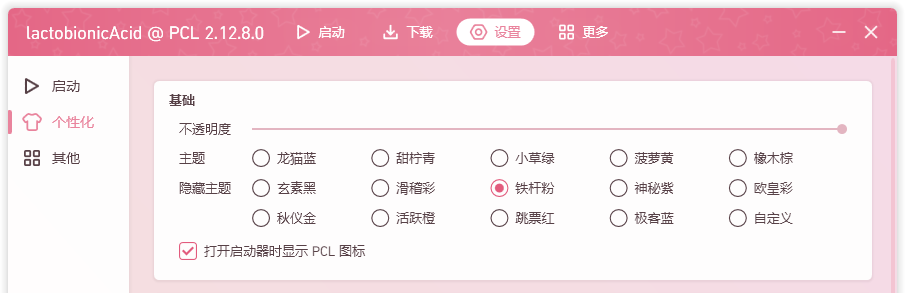

即隐藏主题第 1 行第 3 个主题。如提示所述，你需要**启动 PCL 启动器** 99 次，即可解锁。

<h3 style="color: #9B42B9;">神秘紫</h3>

> 072 101 108 112 032 068 101 118 032 048 046 052 046 052

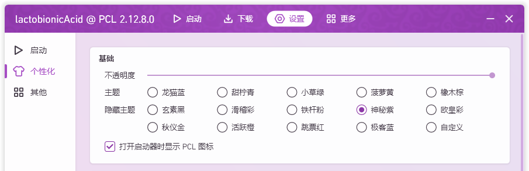

即隐藏主题第 1 行第 4 个主题。将提示中的一连串数字对照 ASCII 表解得 `Help Dev 0.4.4`。

打开爱发电，翻阅龙腾猫跃的动态，找到 [Dev 0.4.4 版本](https://ifdian.net/p/dba42c22c93c11e8a70452540025c377)并下载。之后，打开这个版本，并转到 `帮助` → `开源许可` → `Something Hidden Here`，可以看到有一个按钮 <kbd>??????</kbd>。按下它，之后打开较新的 PCL 启动器，即可发现该主题已解锁。

**⚠ 注意：在部分电脑上解锁神秘紫时，可能导致识别码发生变更，致使丢失所有隐藏主题（[#3316](https://github.com/Meloong-Git/PCL/issues/3316)）。**

<h3><spam style="color: transparent; background: linear-gradient(to right, #7349C2, #B83DB8, #BB3E69); background-clip: text;">欧皇彩</spam></h3>

> 这就是传说中的欧皇了吧

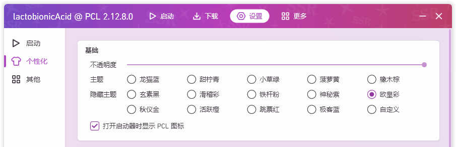

即隐藏主题第 1 行第 5 个主题。转到 `更多` → `百宝箱`，点击 <kbd>今日人品</kbd>。当你的今日人品达到 **100** 时解锁该主题。

什么？你说你抽不到 100 人品值？好吧，其实龙腾猫跃偷偷留了一个后门。如果你更改电脑的日期，那么 PCL 输出的则会是那一天的人品值。所以，你可以不断修改电脑日期，不断刷新人品，直到出现 100 人品值为止。

当然，只要你天天抽一次人品值，总有一天会抽出 100 人品值…… ~~*这就是传说中的欧皇了吧*~~ 
你今天的人品值是：0？！

<h3 style="color: #C9AF2A;">秋仪金</h3>

> 累积赞助达到 ￥23.33 后，在爱发电私信发送【土豆 0123-4567-89AB-CDEF】以解锁

> 右键打开赞助页面，如果觉得 PCL 做得还不错就支持一下吧 =w=！

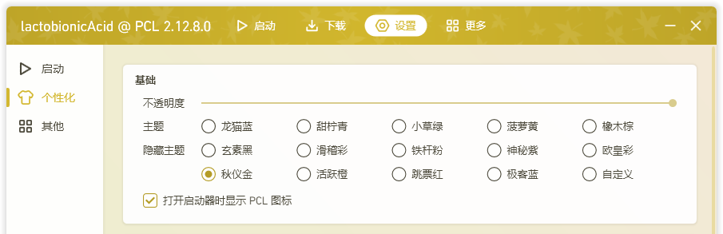

即隐藏主题第 2 行第 1 个主题。前往爱发电，给龙腾猫跃打赏**至少 CNY￥23.33**，然后向龙腾猫跃私信发送 `土豆` 并**附上你当前的 PCL 识别码**，即可获得一串土豆码（2.12.7.2 以前称作“解锁码”）。

土豆码为一串经过 ECDSA 加密的文本，通常如下图所示。

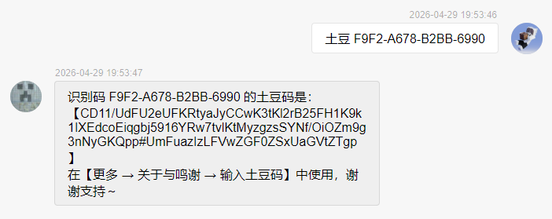

转到 `更多` → `关于与鸣谢` → `赞助者`，点击 <kbd>输入土豆码</kbd>，将这段土豆码复制粘贴过去，然后点击 <kbd>确定</kbd>。

如果你已经打赏过龙腾猫跃了，但是赞助**总价**低于 CNY￥23.33，可以选择下方的 <kbd>自选金额</kbd>，然后补足差价，也可以解锁这个主题。

如果因为更换电脑或其他因素导致识别码变更，你亦可以重新申请土豆码，但需要在回复时带上新的识别码。

<h3 style="color: #E17C33;">活跃橙</h3>

> · 反馈一个 Bug，在标记为 [完成] 后回复识别码要求解锁 
> · 提交一个 Pull Request 或主页预设，在标记为 [完成] 后回复识别码要求解锁

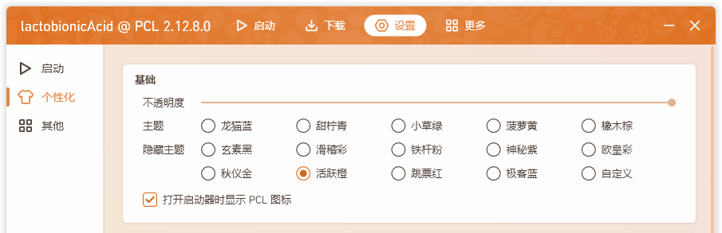

即隐藏主题第 2 行第 2 个主题，亦作为**对 PCL 作出贡献的奖励**。

在**由你提交**且被标记为“完成”的 Pull Request、主页预设投稿或**带 Bug 标签**的 Issue 的评论区下，回复你的 PCL 识别码，即可获得土豆码。点击 <kbd>输入土豆码</kbd>，将你获得的土豆码复制粘贴过去，然后点击 <kbd>确定</kbd>。

此前，活跃橙还可在 LTW3 服务器中用 3 个金块购买，现已失效。

土豆码为一串经过 ECDSA 加密的文本，由龙腾猫跃本人发送，通常如下图所示。

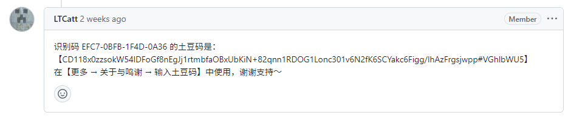

如果因为更换电脑或其他因素导致识别码变更，你亦可以重新申请土豆码，但需要在回复时带上新的识别码。

**⚠ 注意：活跃橙是一种奖励，请勿为了活跃橙而向仓库提交无效或重复的 Issue 等，这会严重打扰到其他协助者。多次打扰亦会导致你的 GitHub 账号被仓库屏蔽。**[*如何优雅地解决问题/提交反馈？*](https://pcl-community.github.io/PCL2-1930-Web/guide.html)

<h3 style="color: #DA4133;">跳票红</h3>

> 进行一次正版登录，支持正版游戏！

> *虽然 Mojang 跳票，但也要恰饭的嘛（旧版 PCL 主题提示）*

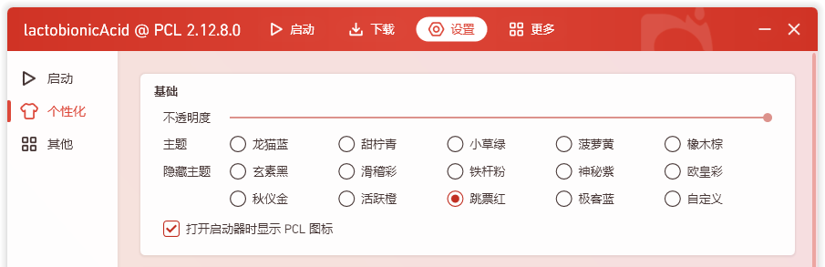

即隐藏主题第 2 行第 3 个主题。如提示所述，只要使用正版 Minecraft 账号登录一次，就能解锁这个主题。

<h3 style="color: #3C55CC;">极客蓝</h3>

> 右键打开解密游戏入口

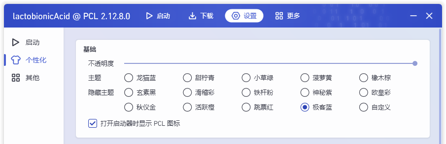

即隐藏主题第 2 行第 4 个主题。在解锁了 3 个隐藏主题后启用解密，右击该主题选项即可打开其入口。

该主题需要使用解锁码解锁，作为解密的一部分。如果你懒得解密（或是解密过程中受阻），这里直接贴出解锁码：

<code>PuzzleUnlock-</code>（你的识别码的末四位）

在解出解锁码后，这个解密尚未结束。如果你感兴趣，可以接着解下去，最终会把你引导到一个 QQ 群中。

你也可以参考前人的已解密内容，[详见此讨论区](https://github.com/Meloong-Git/PCL/discussions/3386)（注：有一部分步骤**不能公开**）。解密初期含有一个已失效网站，可以在此处查看[由 lactobionicAcid 制作的备份](https://docs.qq.com/doc/DQVJuS0J0cnFtRFBR)。

### 自定义

> 需要解锁五个隐藏主题

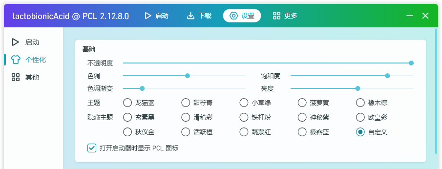

即隐藏主题第 2 行第 5 个主题。在解锁了 5 个隐藏主题后解锁该主题。该主题提供了 4 个额外的自定义项，你可以随心所欲调整 PCL 的颜色。

<h3 style="color: #27459C;">「宇宙的终极答案」</h3>

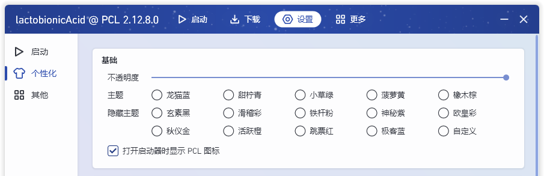

真正的隐藏主题。你需要打开与 PCL 位于同一目录下的 PCL 文件夹，打开并编辑其中的“Setup.ini”文件，将其中 `UiLauncherTheme` 的值改为 **42**。保存文件，重启 PCL 启动器，即可发现该主题已被自动应用。

该主题致敬了《银河系漫游指南》中生命、宇宙以及一切的终极答案：「42」。

然而，这个隐藏主题只有上述唯一的 *一点也不优雅的* 切换方式，也不计入解锁极客蓝解密和自定义主题所需的 3 个或 5 个隐藏主题当中。

众所周知十大隐藏主题一定有 11 个

<h3 style="color: #EEEEEE;">眼瞎白</h3>

“千万别点”中的隐藏主题。点击 <kbd>千万别点</kbd> 时有概率将 PCL 的主题颜色替换为纯白色，同时所有主题的名称均变为“眼瞎白”~~，龙猫向你投掷了一颗闪光弹~~。该主题亦会和“千万别点”产生的其他特效（如有）一起显示。

严格意义上来说这并不能算作隐藏主题，因为其本质是直接对已有的主题进行修改。

该主题的背景颜色仍为当前已选择的主题的颜色，且当选择的主题为“玄素黑”时，PCL 的标题栏仍为黑色；选择的主题为“神秘紫”时，PCL 的标题栏会显现出该主题的花纹水印。

重启 PCL 启动器后该主题失效。

<h3><spam class="rainbow">真・滑稽彩</spam></h3>

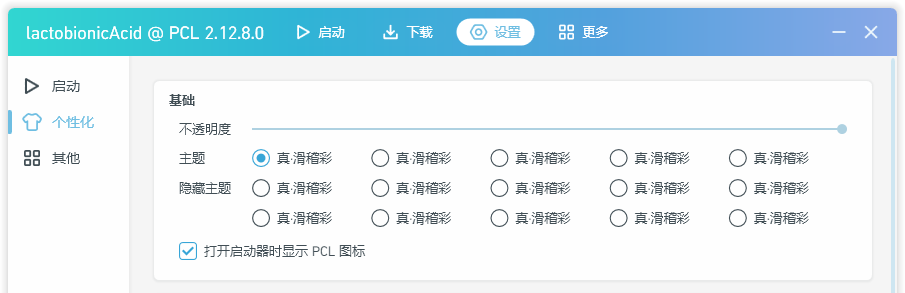

⚠ 光敏性癫痫警告

“千万别点”中的隐藏主题。点击 <kbd>千万别点</kbd> 时有概率将 PCL 主题的颜色以极高的频率更改为随机颜色，同时所有主题的名称均变为“真・滑稽彩”。该主题亦会和“千万别点”产生的其他特效（如有）一起显示。

严格意义上来说这并不能算作隐藏主题，因为其本质是直接对已有的主题进行修改。

在“千万别点”中触发该主题时，PCL 会弹出光敏性癫痫警告。

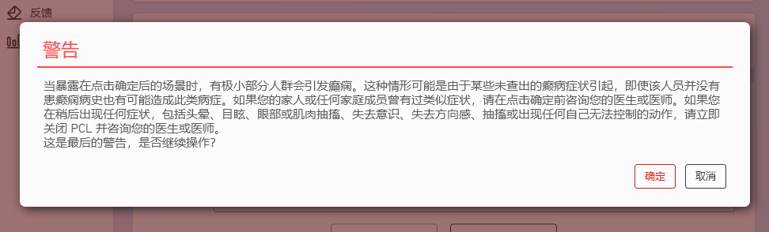

重启 PCL 启动器后该主题失效。

## 结尾

本文写作纯属兴趣使然。文章最初发表在某位群友的[个人 Blog](http://blog.lyyweb.top/archives/Ri8DJYkJ) 上，获得了将近 4700 阅读量，甚至曾一度占领搜索引擎首条。

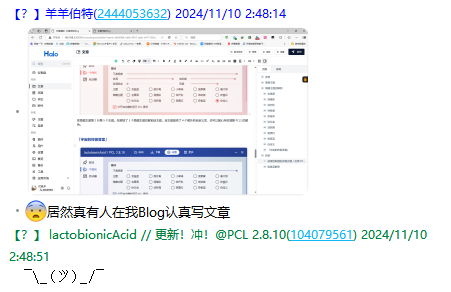

现在正准备将这篇文章迁出。迁到哪里？没人知道……

---
lactobionicAcid

本文首次发表  2024 年 11 月 10 日 03:37
最后一次修改  2026 年  5 月 19 日